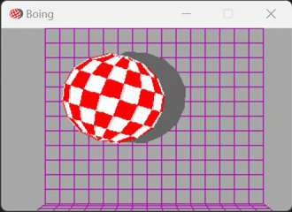

# Amiga Boing Demo Python Reimplementation

This project is a Python reimplementation of the famous Amiga Boing Demo using the Pygame extension.



## Overview

The Amiga Boing Demo was a groundbreaking demonstration of the Amiga computer's graphics capabilities, first showcased in 1984. This Python version aims to recreate the iconic bouncing ball animation with its distinctive sound effects.

## Original Demo

You can watch the original Amiga Boing Demo here:
[Amiga Boing Ball Demo on YouTube](https://www.youtube.com/watch?v=ssUleIBKOW8)

## Implementation Details

This reimplementation is largely based on the C version created by Jimmy Maher, which can be found at:
[Jimmy Maher's Amiga Boing Demo Reimplementation](http://amiga.filfre.net/?page_id=5)

### Features

- Original samples
- Original graphics
- Almost original colors

## Getting Started

Install pygame and run the script:
```
pip install pygame
python boing.py
```


## License

Public Domain.

## Acknowledgements

Special thanks to Jimmy Maher for the C reimplementation that served as the basis for this Python version. And of course to the original authors of the Amiga Boing Demo: Dale Luck and Robert J. Mical.
