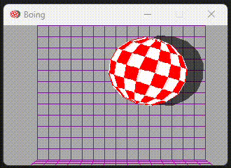

# Amiga Boing Demo Python Reimplementation

This project is a Python reimplementation of the famous Amiga Boing Demo using the Pygame extension.



## Overview

The Amiga Boing Demo was a groundbreaking demonstration of the Amiga computer's graphics capabilities, first showcased in 1984. This Python version aims to recreate the iconic bouncing ball animation with its distinctive sound effects.

## Original Demo

You can watch the original Amiga Boing Demo here:
[Amiga Boing Ball Demo on YouTube](https://www.youtube.com/watch?v=ssUleIBKOW8)

## Implementation Details

This reimplementation is largely based on the C version created by Jimmy Maher, which can be found at:
[Jimmy Maher's Amiga Boing Demo Reimplementation](http://amiga.filfre.net/?page_id=5)

### Features

- Original samples
- Original graphics
- Almost original colors

## Getting Started

To quickly check the demo in your browser (thanks to [pygbag](https://pygame-web.github.io/wiki/pygbag/)), just go to [https://thomasrunge.github.io/boing](https://thomasrunge.github.io/boing).

To want run this Amiga Boing Demo Python reimplementation on your computer, follow these steps:

1. **Install Git**: 
   - Download and install Git from [https://git-scm.com/downloads](https://git-scm.com/downloads)
   - Follow the installation instructions for your operating system

2. **Install Python**:
   - Download and install Python from [https://www.python.org/downloads/](https://www.python.org/downloads/)
   - Make sure to check the box that says "Add Python to PATH" during installation

3. **Clone the repository**:
   - Open a terminal or command prompt (on Windows, you can open a terminal by pressing `Win + R`, typing `cmd`, and pressing Enter)
   - Navigate to the directory where you want to store the project
   - Run the following command:
     ```
     git clone https://github.com/thomasrunge/boing
     ```


4. **Navigate to the project directory**:
   ```
   cd boing
   ```

5. **Create a virtual environment** (optional but recommended):
   ```
   python -m venv venv
   ```

6. **Activate the virtual environment**:
   - On Windows:
     ```
     venv\Scripts\activate
     ```
   - On macOS and Linux:
     ```
     source venv/bin/activate
     ```

7. **Install the required packages**:
   ```
   pip install pygame
   ```

8. **Run the script**:
   ```
   python boing.py
   ```

You should now see the Amiga Boing Demo running on your screen!

To exit the demo, close the window or press ESC or 'q' in the demo window.

Press 'F11' to toggle fullscreen. Press 's' to toggle scanlines. Drag the mouse to simulate the typical Amiga screen drag.

If you encounter any issues, make sure you have the latest versions of Python and Pygame installed, and that all the necessary files (including sound and image assets) are present in the project directory.

## License

Public Domain.

## Acknowledgements

Special thanks to Jimmy Maher for the C reimplementation that served as the basis for this Python version. And of course to the original authors of the Amiga Boing Demo: Dale Luck and Robert J. Mical.
